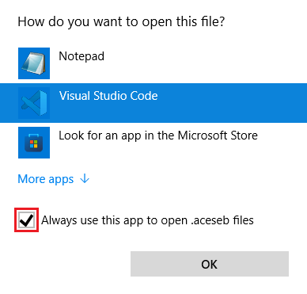

# ACES Equipment Builder

## Overview

This program is a desktop application that interfaces with *WebCTRL* to generate *EIKON* scripts using custom *.logicsymbol* libraries. *ACES EB* is also capable of maintaining a shared set of favorite *.logicsymbol* and *.logic-script* files. *ACES EB* was developed for *Windows* and has not been tested on *Mac* or *Linux* operating systems.

The primary *.logicsymbol* library should be stored on a shared network drive. *ACES EB* maintains a local copy of the shared library to ensure the application can be used when offline. Synchronization occurs when the application is launched, if the shared library is accessible.

If you are a software developer who is interested in contributing to *ACES EB*, see the [developer documentation](../README.md). If you find a bug in the application, you can email <cvogt@automaticcontrols.net> or [open an issue](https://github.com/automatic-controls/aces-equipment-builder/issues). If an error occurs, please attach the relevant section of your log file. Use **CTRL+L** to open your log file from *ACES EB*.

Anytime you see text enclosed by *%* in this document, assume the enclosed text refers to an environment variable of your computer. For example, *%Username%* expands to the username of the currently logged in user. To see what an environment variable expands to, type `echo %VARIABLE%` in *command prompt*.

## Installation

There are two installation methods depending on how your network administrators setup *ACES EB*.

- If you have been directed to use a script installer (e.g, *Installer.bat*) located on a shared network drive, running the installer will take care of everything for you. A shortcut to the *ACES EB* executable will be created on your desktop.

- If you downloaded the latest release ([direct download link](<!-- TODO -->)), or were given a *.zip* archive, the first step is to unzip the archive and place the contents in an empty folder. The recommended folder location is "*%LocalAppData%/Programs/ACES Equipment Builder*". For convenience, place a shortcut to "*ACES Equipment Builder.exe*" on your desktop.

You may be required to specify where the remote synchronization directory is located when you launch *ACES EB* for the first time. Usually, this will be a folder on a shared network drive.

- If you want to use *ACES EB* without remote synchronization, you should leave this entry blank. Note that some developer tools are disabled when the remote directory is unspecified or inaccesible.

- Typically, the remote directory location is not changed after the initial setup, but you can use **CTRL+O** while in [*developer mode*](#keyboard-shortcuts) if necessary.

You may be required to specify your *WebCTRL* installation directory. It is recommended to close all *EIKON* instances before binding to *WebCTRL*. You can rebind to another installation of *WebCTRL* at any time using [keyboard shortcut](#keyboard-shortcuts) **CTRL+K** or **CTRL+ALT+K**.

## Uninstallation

1. Determine the location of the installation directory.
   - Navigate to the origin of your *ACES EB* desktop shortcut.
2. Delete the *ACES EB* installation directory.
3. Delete the *ACES EB* desktop shortcut.

## Basic Operation

1. Launch *ACES EB* and make selections to customize your equipment.
   - If you click on an item and its icon becomes highlighted in orange, you can use the arrow-keys to change the numeric value associated to the selected item.
2. When everything is ready, click the "*Generate Script*" button.
   - An error message will be generated if you haven't made appropriate selections.
3. Launch *EIKON*.
   - **CTRL+E** launches an *EIKON* instance corresponding to the currently bound *WebCTRL* installation.
4. Navigate to " *Tools &#10148; Scripts &#10148; Generated Script &#10148; Execute* " within *EIKON*.
   - Wait for the window to display "*Execution Completed Succesfully*" before exiting the script editor.

## Keyboard Shortcuts

| Shortcut | Description |
| - | - |
| **F3** | Reloads local library files into the application. |
| **F5** | Synchronizes to the remote directory and reloads. |
| **CTRL+E** | Open an instance of *EIKON* using the previously bound *WebCTRL* installation. |
| **CTRL+O** | Opens a window to configure various [settings](#application-settings). More options are available when in developer mode. |
| **CTRL+L** | Opens the log file using the default text editor. |
| **CTRL+K** | Rebinds to another installation of *WebCTRL*. If there is only one version installed, it will be automatically selected. The application looks for folders in *%SystemDrive%* which match the regular expression *`WebCTRL\d+\.\d+`* |
| **CTRL+ALT+K** | Rebinds to another installation of *WebCTRL*. The application will not automatically detect installation directories. You must manually navigate to the appropriate folder. |
| **CTRL+D+E+V** | Toggles *developer mode*. |
| **CTRL+F** | Requires *developer mode*. Initiates a global search through all configuration files in the remote library. Refer to [*Oracle's* Pattern documentation](https://docs.oracle.com/en/java/javase/16/docs/api/java.base/java/util/regex/Pattern.html) for details regarding regular expression syntax. |
| **DELETE** | Requires *developer mode*. Deletes the item the mouse is hovering over in the remote library after prompting for confirmation. |

## Right-Click Context Menu

When *developer mode* is not active, the following menu shows up when you right-click anywhere. When *developer mode* is active, this menu shows up only when you right-click at a location not corresponding to an item.

| Symbol | Name | Description |
|  - | - | - |
|  | *Synchronize Library* | Equivalent to **F5**. |
|  | *Reload Library* | Equivalent to **F3**. |
|  | *Launch EIKON* | Equivalent to **CTRL+E**. |
|  | *Edit Configuration Options* | Equivalent to **CTRL+O**. |
|  | *Rebind WebCTRL* | Equivalent to **CTRL+K**. |
|  | *Open Log File* | Equivalent to **CTRL+L**. |
|  | *Global Find/Replace* | Requires *developer mode*. Equivalent to **CTRL+F**. |
|  | *Configure* | Requires *developer mode*. Opens the configuration file corresponding to the root library folder using the default editor. You should [setup VSCode](#visual-studio-code) before using this shortcut. If a configuration file does not already exist, one will be created after prompting for confirmation. |

<br>The following menu shows up when you are in *developer mode* and right-click on an item.

| Symbol | Name | Description |
|  - | - | - |
|  | *Open* | Opens the item you clicked on in the remote library. If the item corresponds to a *.logicsymbol* file, it will open in *EIKON*. If the item corresponds to a directory, it will open in *Windows File Explorer*. |
|  | *Configure* | Opens the configuration file corresponding to the item you clicked on in the remote library using the default editor. You should [setup VSCode](#visual-studio-code) before using this shortcut. If a configuration file does not already exist, one will be created after prompting for confirmation. |
|  | *Delete* | Deletes the item you clicked on in the remote library. |
|  | *Find/Replace Within* | Similar to **CTRL+F** except the scope is restricted to everything below the item you clicked on. |
|  | *Find All References* | Searches the library to find all items which have been initialized using a [reference](#initialization-by-reference) to the item you clicked on. It is good practice to check which sections of a library rely on an item before making modifications. |
|  | *Find Direct References* | Similar to *Find All References* except that implicit references are not tracked. For example, suppose **A** &#8594; **B** &#8594; **C** &#8594; **D**, meaning **A** refers to **B**, **B** refers to **C**, and **C** refers to **D**. Under these assumptions, *FindAllReferences(**D**) = {**A**, **B**, **C**}* and *FindDirectReferences(**D**) = {**C**}*. |

## Application Settings

Only the first four settings are visible when *developer mode* is not active. The last two settings are never visible from within the application. They can be modified by editing the application's configuration file (*./config.txt* relative to the installation directory). Use **F3** to reload the configuration file if you make changes.

| Setting | Description |
| - | - |
| *Auto Synchronize* | Specifies whether to synchronize whenever the application is launched. If this value is `false`, then synchronization must be initiated manually using **F5**. |
| *Synchronize Library* | Whenever synchonization occurs, this specifies whether the application should sync *.logicsymbol* library files. |
| *Synchronize Favorites* | Whenever synchronization occurs, this specifies whether the application should sync favorite *.logicsymbol* files. |
| *Synchronize Scripts* | Whenever synchronization occurs, this specifies whether the application should sync favorite *.logic-script* files. |
| *Allow Hidden Entries* | Specifies whether to allow hidden entries in the *.logicsymbol* library. |
| *Allow Locked Entries* | Specifies whether to allow locked entries in the *.logicsymbol* library. |
| *Allow Default Selections* | Specifies whether to allow default selections in the *.logicsymbol* library. |
| *Allow Group Minimums* | Specifies whether to allow *Group* minimums in the *.logicsymbol* library. |
| *Allow Group Maximums* | Specifies whether to allow *Group* maximums in the *.logicsymbol* library. |
| *Allow If-Then Statements* | Specifies whether to allow *If-Then* statements in the *.logicsymbol* library. |
| *Remote Directory Path* | Specifies the folder to synchronize against. This folder is typically located on a shared network drive. |
| `WebCTRLPath` | Absolute path to the *WebCTRL* installation directory (e.g, *C:\\WebCTRL8.0*). This value is modified using **CTRL+K** or **CTRL+ALT+K**. |
| `SupportMessage` | If any error occurs, this message will be included in the pop-up shown to the user. |
| `EmailTo` | A semicolon-delimited list of email addresses (e.g, *abc&#65279;@gmail.com;def&#65279;@gmail.com*) to show when the "*Contact Engineering*" button is pressed. |

## Remote Directory Settings

When you select a remote synchronization directory, the application will automatically generate *config.txt* in the selected folder. The following table describes the settings which can be found in *config.txt*. For additional details, refer to [developer documentation](../README.md#automated-updates).
| Setting | Description |
| - | - |
| `Version` | The minimum application version compatible with the associated *.logicsymbol* library. This setting may be used to push application updates out to all connected users. Upon synchronization, each application will attempt to update if outdated. |
| `UpdateScript` | The script to run when attempting to update. Resolved absolutely or relatively to the remote directory. |
| `AllowSync` | When an application instance attempts to synchronize, it first checks this settings. If `AllowSync` is `false` and *developer mode* is not active, then synchronization is disabled. When modifying shared files, this settings can be used to control when changes become visible. |
| `Library` | Relative path to the shared root *.logicsymbol* library folder. Resolved relatively to the remote directory. Default value is *Library*. |
| `Favorites` | Relative path to the shared folder containing favorite *.logicsymbol* files. Resolved relatively to the remote directory. Default value is *Favorites*. |
| `Scripts` | Relative path to the shared folder containing favorite *.logic-script* files. Resolved relatively to the remote directory. Default value is *Scripts*. |

## Favorite *logicsymbols* and *logic-scripts*

To setup shared *.logicsymbol* files, drop them into the *Favorites* folder of the remote directory. Note that *.equipment* files should be renamed to *.logicsymbol* before being shared. To setup shared *.logic-script* files, drop them into the *Scripts* folder of the remote directory. *logic-script* files are written in the [*Apache Groovy*](https://groovy-lang.org/) programming language, a superset of *Java*. Refer to script documentation included in your *WebCTRL* installation (e.g, *C:/WebCTRL8.0/resources/logicbuilder/plugins/script/help/index.html*). Note that script documentation will only be available after activating the script plugin for *EIKON*.

### Recommendation

*EIKON* does not automatically refresh which scripts are available. If you generate a script after opening *EIKON*, the new script will not show up until *EIKON* is restarted. To circumvent this problem, it is recommended to create a shared script with the name "*Generated Script.logic-script*". This shared script should display a message telling the user to generate a script. The following code block provides an example.

```java
javax.swing.JOptionPane.showMessageDialog(null, "Please use ACES Equipment Builder to generate a script.");
```

## Library Configuration Essentials

### Basic Example

The interface shown by the application directly corresponds to the file structure of the root *.logicsymbol* library folder.

  

### Naming Conventions

All *.equipment* files should be renamed with the *.logicsymbol* extension before attempting library configuration. The following command prompt instruction can be used for bulk renaming: `for /r "S:\path\to\shared\library\root\folder" %i in (*.equipment) do @rename "%i" "%~ni.logicsymbol"`

*logicsymbol* filenames must be alphanumeric, lowercase, under *40* characters long, and use underscores instead of spaces. The application will automatically convert *logicsymbol* filenames to title-case, replacing underscores with spaces. Folder names are shown unmodified. Unlimited folder nesting is supported.

### Configuration File Explanation

For the generated *EIKON* script to execute successfully, you need to create *config.aceseb* in the root library folder as shown in the example. *config.aceseb* is a text file that provides additional instructions to the application. At this point, you don't need to understand the purpose of the `PreScript` or `PostScript` sections.

In the example, the first three lines of *config.aceseb* tell the application to include *header.logicsymbol*, *Heating*, and *Zone Monitoring*. If a file or folder is not included in the configuration file, then it will not appear in the application, regardless of whether it exists in the file tree. Note that *.logicsymbol* extensions are excluded in the configuration file.

Configuration files may be included in any subfolder of the *.logicsymbol* library. Their basic function it to specify a custom ordering for folder contents, overriding the default alphanumeric sort. Note that configuration files in subfolders should not have `PreScript` or `PostScript` sections (unless you know what you are doing, these sections should only be used in the root folder). They are case sensitive, so you must ensure every detail is typed precisely as intended. All errors are flagged by the application when the library is loaded. Error messages typically specify the location of the configuration file and the line number on which the error occurred.

## *Visual Studio Code*

Any text editor (e.g, *Notepad*) can be used to edit *.logicsymbol* library configuration files, but *VSCode* is the recommended editor. This section describes how to install and configure *VSCode*.

1. Install [*Visual Studio Code*](https://code.visualstudio.com/) version 1.62 or later.

1. Install the [*ACES EB* extension](https://github.com/automatic-controls/vscode-aces-equipment-builder) for *VSCode*. This extension provides language support for *ACES EB* configuration files.

   - Download the latest *.vsix* extension release file ([direct download link](https://github.com/automatic-controls/vscode-aces-equipment-builder/releases/download/v1.0.0/aces-eb-language-support-1.0.0.vsix)), and then [install](https://code.visualstudio.com/docs/editor/extension-marketplace#_install-from-a-vsix) the extension in *VSCode*.

     

1. Set *VSCode* as the default application to open *.aceseb* configuration files.

   - *Windows File Explorer &#10148; Right-click .aceseb file &#10148; Open with &#10148; Choose another app &#10148;*

     

## Advanced Library Configuration

This section serves as a reference for *.logicsymbol* library configuration file syntax. Refer to [Library Configuration Essentials](#library-configuration-essentials) before diving into this section.

### Direct Initialization

Initialization statements are used to load a file or folder into the application. The configuration file must be in the same directory as the item being initialized. If a folder does not have a configuration file, then all contents are loaded. Do not include *.logicsymbol* extensions in the configuration file.

  

### Comments

*Java*-style comments are supported in configuration files. Comments are ignored by the application. Single-line comments start with `//`. Multi-line comments begin with `/*` and end with `*/`. For maximum compatibility, comments should be placed on new lines.

It is also possible to mark a single-line or multi-line section as *developer-only*. These sections will only load into the application when *developer mode* is active. When *developer mode* is not active, these sections are treated as regular comments. Single-line developer comments start with `///`. Multi-line developer comments begin with `/**` and end with `*/`. Developer comments may be combined with the `AllowSync` [setting](#remote-directory-settings) to control which *.logicsymbol* library sections are visible to users.


### Display Names

The display name of each item as shown in the application may be changed by enclosing the new name in double quotes. Certain special characters may be included in display names by enclosing the Unicode hex value in curly braces. An example is shown below where subscript *2* is shown using hex-code *2082*. Other common hex codes can be found on the internet. Use a backslash to escape the following special characters `\{}[]<>?:`

  

As shown in the example, it is possible to include the same file twice; however, this is not recommended. Generally, it is a bad idea to have two items with identical reference names in the same folder. In this case, the common reference name is *co2*. Also refer to [Property Retrieval](#property-retrieval) and [Ternary Operator](#ternary-operator).

### Groupings

<!-- TODO -->

### Reference Paths

Slashes are used as the standard path separator. By default, paths are resolved relatively to the surrounding context (usually the folder containing the configuration file). If a path starts with a slash, then it is resolved absolutely from the root library folder instead. `~` may be used to jump to parent folders. Path elements are case-sensitive and should not include *.logicsymbol* extensions.

<!-- TODO: explain .../Group(n,m)/..., where it can be used (init, properties, if-then) -->

### Initialization by Reference

To reduce synchronization time and conserve disk space, library sections can be reused. Any initialization statement containing a slash (`/` or `\`) is treated as a [reference path](#reference-paths) to another section. Relative paths are resolved from the folder containing the configuration file.

<!-- TODO: describe initialization order with example diagram -->

### Initialization Modifiers

<!-- TODO: explain @*+- modifiers -->

### Property Retrieval

<!-- TODO: explain syntax <path|var>, where it can be used (expression, display name, condition, if-then), and provide table of properties. -->

### Boolean Expressions

<!-- TODO: explain syntax and where it can be used (ternary, condition, if-then) -->

### Ternary Operator

<!-- TODO: explain syntax [expr?str1:str2] and where it can be used (display names, condition) -->

### *If-Then* Statements

<!-- TODO: @*+- modifiers, pre-expression, and property set syntax -->

### *Value* Statements

<!-- TODO: syntax and explanation -->

### *Condition* Statements

<!-- TODO: syntax and explanation -->

### *PreScript* and *PostScript*

<!-- TODO: syntax and explanation -->

### Complete Example

<!-- TODO: example which includes everything -->


<!-- General TODO 
   convert the shared ACES library to the new format
-->