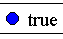

# ACES Equipment Builder

## Contents

- [Overview](#overview)
- [Installation](#installation)
- [Uninstallation](#uninstallation)
- [Basic Operation](#basic-operation)
- [Keyboard Shortcuts](#keyboard-shortcuts)
- [Right-Click Context Menu](#right-click-context-menu)
- [Application Settings](#application-settings)
- [Remote Directory Settings](#remote-directory-settings)
- [Favorites *logicsymbols* and *logic-scripts*](#favorite-logicsymbols-and-logic-scripts)
- [Library Configuration Essentials](#library-configuration-essentials)
- [*Visual Studio Code*](#visual-studio-code)
- [Advanced Library Configuration](#advanced-library-configuration)

## Overview

This program is a desktop application that interfaces with *WebCTRL* to generate *EIKON* scripts using custom *.logicsymbol* libraries. *ACES EB* is also capable of maintaining a shared set of favorite *.logicsymbol* and *.logic-script* files. *ACES EB* was developed for *Windows* and has not been tested on *Mac* or *Linux* operating systems.

The primary *.logicsymbol* library should be stored on a shared network drive. *ACES EB* maintains a local copy of the shared library to ensure the application can be used when offline. Synchronization occurs when the application is launched, if the shared library is accessible.

If you are a software developer who is interested in contributing to *ACES EB*, see the [developer documentation](../README.md). If you find a bug in the application, you can email <cvogt@automaticcontrols.net> or [open an issue](https://github.com/automatic-controls/aces-equipment-builder/issues). If an error occurs, please attach the relevant section of your log file. Use **CTRL+L** to open your log file from *ACES EB*.

Anytime you see text enclosed by *%* in this document, assume the enclosed text refers to an environment variable of your computer. For example, *%Username%* expands to the username of the currently logged in user. To see what an environment variable expands to, type `echo %VARIABLE%` in *command prompt*.

## Installation

There are two installation methods depending on how your network administrators setup *ACES EB*.

- If you have been directed to use a script installer (e.g, *Installer.bat*) located on a shared network drive, running the installer will take care of everything for you. A shortcut to the *ACES EB* executable will be created on your desktop.

- If you downloaded the latest release ([direct download link](https://github.com/automatic-controls/aces-equipment-builder/releases/latest/download/aces-equipment-builder.zip)), or were given a *.zip* archive, the first step is to unzip the archive and place the contents in an empty folder. The recommended folder location is "*%LocalAppData%/Programs/ACES Equipment Builder*". For convenience, place a shortcut to "*ACES Equipment Builder.exe*" on your desktop.

You may be required to specify where the remote synchronization directory is located when you launch *ACES EB* for the first time. Usually, this will be a folder on a shared network drive.

- If you want to use *ACES EB* without remote synchronization, you should leave this entry blank. Note that some developer tools are disabled when the remote directory is unspecified or inaccesible.

- Typically, the remote directory location is not changed after the initial setup, but you can use **CTRL+O** while in [*developer mode*](#keyboard-shortcuts) if necessary.

You may be required to specify your *WebCTRL* installation directory. It is recommended to close all *EIKON* instances before binding to *WebCTRL*. You can rebind to another installation of *WebCTRL* at any time using [keyboard shortcut](#keyboard-shortcuts) **CTRL+K** or **CTRL+ALT+K**.

## Uninstallation

1. Determine the location of the installation directory.
   - Navigate to the origin of your *ACES EB* desktop shortcut.
2. Delete the *ACES EB* installation directory.
3. Delete the *ACES EB* desktop shortcut.

## Basic Operation

1. Launch *ACES EB* and make selections to customize your equipment.
   - If you click on an item and its icon becomes highlighted in orange, you can use the arrow-keys to change the numeric value associated to the selected item.
2. When everything is ready, click the "*Generate Script*" button.
   - An error message will be generated if you haven't made appropriate selections.
3. Launch *EIKON*.
   - **CTRL+E** launches an *EIKON* instance corresponding to the currently bound *WebCTRL* installation.
4. Navigate to " *Tools &#10148; Scripts &#10148; Generated Script &#10148; Execute* " within *EIKON*.
   - Wait for the window to display "*Execution Completed Succesfully*" before exiting the script editor.

## Keyboard Shortcuts

| Shortcut | Description |
| - | - |
| **F3** | Reloads local library files into the application. |
| **F5** | Synchronizes to the remote directory and reloads. |
| **CTRL+E** | Open an instance of *EIKON* using the previously bound *WebCTRL* installation. |
| **CTRL+O** | Opens a window to configure various [settings](#application-settings). More options are available when in developer mode. |
| **CTRL+L** | Opens the log file using the default text editor. |
| **CTRL+K** | Rebinds to another installation of *WebCTRL*. If there is only one version installed, it will be automatically selected. The application looks for folders in *%SystemDrive%* which match the regular expression *`WebCTRL\d+\.\d+`* |
| **CTRL+ALT+K** | Rebinds to another installation of *WebCTRL*. The application will not automatically detect installation directories. You must manually navigate to the appropriate folder. |
| **CTRL+D+E+V** | Toggles *developer mode*. |
| **CTRL+F** | Requires *developer mode*. Initiates a global search through all configuration files in the remote library. Refer to [*Oracle's* Pattern documentation](https://docs.oracle.com/en/java/javase/16/docs/api/java.base/java/util/regex/Pattern.html) for details regarding regular expression syntax. |
| **DELETE** | Requires *developer mode*. Deletes the item the mouse is hovering over in the remote library after prompting for confirmation. |

## Right-Click Context Menu

When *developer mode* is not active, the following menu shows up when you right-click anywhere. When *developer mode* is active, this menu shows up only when you right-click at a location not corresponding to an item.

| Symbol | Name | Description |
|  - | - | - |
|  | *Synchronize Library* | Equivalent to **F5**. |
|  | *Reload Library* | Equivalent to **F3**. |
|  | *Launch EIKON* | Equivalent to **CTRL+E**. |
|  | *Edit Configuration Options* | Equivalent to **CTRL+O**. |
|  | *Rebind WebCTRL* | Equivalent to **CTRL+K**. |
|  | *Open Log File* | Equivalent to **CTRL+L**. |
|  | *Open Generated Script* | Requires *developer mode*. Opens the generated script using the default application set by the user (usually a text editor). |
|  | *Global Find/Replace* | Requires *developer mode*. Equivalent to **CTRL+F**. |
|  | *Configure* | Requires *developer mode*. Opens the configuration file corresponding to the root library folder using the default editor. You should [setup VSCode](#visual-studio-code) before using this shortcut. If a configuration file does not already exist, one will be created after prompting for confirmation. |

<br>The following menu shows up when you are in *developer mode* and right-click on an item.

| Symbol | Name | Description |
|  - | - | - |
|  | *Open* | Opens the item you clicked on in the remote library. If the item corresponds to a *.logicsymbol* file, it will open in *EIKON*. If the item corresponds to a directory, it will open in *Windows File Explorer*. |
|  | *Configure* | Opens the configuration file corresponding to the item you clicked on in the remote library using the default editor. You should [setup VSCode](#visual-studio-code) before using this shortcut. If a configuration file does not already exist, one will be created after prompting for confirmation. |
|  | *Delete* | Deletes the item you clicked on in the remote library. |
|  | *Find/Replace Within* | Similar to **CTRL+F** except the scope is restricted to everything below the item you clicked on. |
|  | *Find All References* | Searches the library to find all items which have been initialized using a [reference](#initialization-by-reference) to the item you clicked on. It is good practice to check which sections of a library rely on an item before making modifications. |
|  | *Find Direct References* | Similar to *Find All References* except that implicit references are not tracked. For example, suppose **A** &#8594; **B** &#8594; **C** &#8594; **D**, meaning **A** refers to **B**, **B** refers to **C**, and **C** refers to **D**. Under these assumptions, *FindAllReferences(**D**) = {**A**, **B**, **C**}* and *FindDirectReferences(**D**) = {**C**}*. |

## Application Settings

Only the first four settings are visible when *developer mode* is not active. All settings can be modified at *./config.txt* relative to the installation directory. Use **F3** to reload the configuration file if you make changes.

| Setting | Description |
| - | - |
| *Auto Synchronize* | Specifies whether to synchronize whenever the application is launched. If this value is `false`, then synchronization must be initiated manually using **F5**. |
| *Synchronize Library* | Whenever synchonization occurs, this specifies whether the application should sync *.logicsymbol* library files. |
| *Synchronize Favorites* | Whenever synchronization occurs, this specifies whether the application should sync favorite *.logicsymbol* files. |
| *Synchronize Scripts* | Whenever synchronization occurs, this specifies whether the application should sync favorite *.logic-script* files. |
| *Allow Hidden Entries* | Specifies whether to allow hidden entries in the *.logicsymbol* library. |
| *Allow Locked Entries* | Specifies whether to allow locked entries in the *.logicsymbol* library. |
| *Allow Default Selections* | Specifies whether to allow default selections in the *.logicsymbol* library. |
| *Allow Group Minimums* | Specifies whether to allow *Group* minimums in the *.logicsymbol* library. |
| *Allow Group Maximums* | Specifies whether to allow *Group* maximums in the *.logicsymbol* library. |
| *Allow If-Then Statements* | Specifies whether to allow *If-Then* statements in the *.logicsymbol* library. |
| *Remote Directory Path* | Specifies the folder to synchronize against. This folder is typically located on a shared network drive. |
| *WebCTRLPath* | Absolute path to the *WebCTRL* installation directory (e.g, *C:\\WebCTRL8.0*). This value is modified using **CTRL+K** or **CTRL+ALT+K**. |
| *SupportMessage* | If any error occurs, this message will be included in the pop-up shown to the user. |
| *EmailTo* | Semicolon-delimited list of email addresses (e.g, *abc&#65279;@gmail.com;def&#65279;@gmail.com*) to show when the "*Contact Engineering*" button is pressed. |
| *VersionTag* | Used for version control unrelated to the application's source code. Refer to [developer documentation](../README.md#automated-updates) for more details. |
| *Developer* | Whether the user is in *developer mode*. |

## Remote Directory Settings

When you select a remote synchronization directory, the application will automatically generate *config.txt* in the selected folder. The following table describes the settings which can be found in *config.txt*. For additional details, refer to [developer documentation](../README.md#automated-updates).
| Setting | Description |
| - | - |
| *Version* | The minimum application version compatible with the associated *.logicsymbol* library. This setting may be used to push application updates out to all connected users. Upon synchronization, each application will attempt to update if outdated. |
| *UpdateScript* | The script to run when attempting to update. Resolved absolutely or relatively to the remote directory. |
| *AllowSync* | When an application instance attempts to synchronize, it first checks this settings. If `AllowSync` is `false` and *developer mode* is not active, then synchronization is disabled. When modifying shared files, this settings can be used to control when changes become visible. |
| *Library* | Relative path to the shared root *.logicsymbol* library folder. Resolved relatively to the remote directory. Default value is *Library*. |
| *Favorites* | Relative path to the shared folder containing favorite *.logicsymbol* files. Resolved relatively to the remote directory. Default value is *Favorites*. |
| *Scripts* | Relative path to the shared folder containing favorite *.logic-script* files. Resolved relatively to the remote directory. Default value is *Scripts*. |

## Favorite *logicsymbols* and *logic-scripts*

To setup shared *.logicsymbol* files, drop them into the *Favorites* folder of the remote directory. Note that *.equipment* files should be renamed to *.logicsymbol* before being shared. To setup shared *.logic-script* files, drop them into the *Scripts* folder of the remote directory. *logic-script* files are written in the [*Apache Groovy*](https://groovy-lang.org/) programming language, a superset of *Java*. Refer to script documentation included in your *WebCTRL* installation (e.g, *C:/WebCTRL8.0/resources/logicbuilder/plugins/script/help/index.html*). Note that script documentation will only be available after activating the script plugin for *EIKON*.

### Recommendation

*EIKON* does not automatically refresh which scripts are available. If you generate a script after opening *EIKON*, the new script will not show up until *EIKON* is restarted. To circumvent this problem, it is recommended to create a shared script with the name "*Generated Script.logic-script*". This shared script should display a message telling the user to generate a script. The following code block provides an example.

```java
javax.swing.JOptionPane.showMessageDialog(null, "Please use ACES Equipment Builder to generate a script.");
```

## Library Configuration Essentials

### Basic Example

The interface shown by the application directly corresponds to the file structure of the root *.logicsymbol* library folder.

  

### Naming Conventions

All *.equipment* files should be renamed with the *.logicsymbol* extension before attempting library configuration. The following command prompt instruction can be used for bulk renaming:
```
for /r "S:\path\to\shared\library\root\folder" %i in (*.equipment) do @rename "%i" "%~ni.logicsymbol"
```

*logicsymbol* filenames must be alphanumeric, lowercase, under *40* characters long, and use underscores instead of spaces. The application will automatically convert *logicsymbol* filenames to title-case, replacing underscores with spaces. Folder names are shown unmodified. Unlimited folder nesting is supported.

### Configuration File Explanation

For the generated *EIKON* script to execute successfully, you need to create *config.aceseb* in the root library folder as shown in the example. *config.aceseb* is a text file that provides additional instructions to the application. At this point, you don't need to understand the purpose of the `PreScript` or `PostScript` sections.

In the example, the first three lines of *config.aceseb* tell the application to include *header.logicsymbol*, *Heating*, and *Zone Monitoring*. If a file or folder is not included in the configuration file, then it will not appear in the application, regardless of whether it exists in the file tree. Note that *.logicsymbol* extensions are excluded in the configuration file.

Configuration files may be included in any subfolder of the *.logicsymbol* library. Their basic function it to specify a custom ordering for folder contents, overriding the default alphanumeric sort. Note that configuration files in subfolders should not have `PreScript` or `PostScript` sections (unless you know what you are doing, these sections should only be used in the root folder). They are case sensitive, so you must ensure every detail is typed precisely as intended. All errors are flagged by the application when the library is loaded. Error messages typically specify the location of the configuration file and the line number on which the error occurred.

## *Visual Studio Code*

Any text editor (e.g, *Notepad*) can be used to edit *.logicsymbol* library configuration files, but *VSCode* is the recommended editor. This section describes how to install and configure *VSCode*.

1. Install [*Visual Studio Code*](https://code.visualstudio.com/) version 1.62 or later.

1. Install the [*ACES EB* extension](https://github.com/automatic-controls/vscode-aces-equipment-builder) for *VSCode*. This extension provides language support for *ACES EB* configuration files.

   - Download the latest *.vsix* extension release file ([direct download link](https://github.com/automatic-controls/vscode-aces-equipment-builder/releases/latest/download/aces-eb-language-support.vsix)), and then [install](https://code.visualstudio.com/docs/editor/extension-marketplace#_install-from-a-vsix) the extension in *VSCode*.

     

1. Set *VSCode* as the default application to open *.aceseb* configuration files.

   - *Windows File Explorer &#10148; Right-click .aceseb file &#10148; Open with &#10148; Choose another app &#10148;*

     

## Advanced Library Configuration

This section serves as a reference for *.logicsymbol* library configuration file syntax. Refer to [Library Configuration Essentials](#library-configuration-essentials) before diving into this section.

- [Direct Initialization](#direct-initialization)
- [Comments](#comments)
- [Display Names](#display-names)
- [Groupings](#groupings)
- [Reference Paths](#reference-paths)
- [Initialization by Reference](#initialization-by-reference)
- [Initialization Modifiers](#initialization-modifiers)
- [Property Retrieval](#property-retrieval)
- [*Value* Statements](#value-statements)
- [Ternary Operators](#ternary-operators)
- [Boolean Expressions](#boolean-expressions)
- [*Condition* Statements](#condition-statements)
- [*If-Then* Statements](#if-then-statements)
- [*PreScript* and *PostScript*](#prescript-and-postscript)

### Direct Initialization

Initialization statements are used to load a file or folder into the application. The configuration file must be in the same directory as the item being initialized. If a folder does not have a configuration file, then all contents are loaded. Do not include *.logicsymbol* extensions in the configuration file.

#### Example

  

### Comments

*Java*-style comments are supported in configuration files. Comments are ignored by the application. Single-line comments start with `//`. Multi-line comments begin with `/*` and end with `*/`. For maximum compatibility, comments should be placed on new lines.

It is also possible to mark a single-line or multi-line section as *developer-only*. These sections will only load into the application when *developer mode* is active. When *developer mode* is not active, these sections are treated as regular comments. Single-line developer comments start with `///`. Multi-line developer comments begin with `/**` and end with `*/`. Developer comments may be combined with the `AllowSync` [setting](#remote-directory-settings) to control which *.logicsymbol* library sections are visible to users.

#### Example


### Display Names

The display name of each item as shown in the application may be changed by enclosing the new name in double quotes. Certain special characters may be included in display names by enclosing the Unicode hex value in curly braces. An example is shown below where subscript *2* is shown using hex-code *2082*. Other common hex codes can be found on the internet. Use a backslash to escape the following special characters `\{}[]<>?:`

#### Example

  

As shown in the example, it is possible to include the same file twice; however, this is not recommended. Generally, it is a bad idea to have two items with identical reference names in the same folder. In this case, the common reference name is *co2*. Refer to [Property Retrieval](#property-retrieval) and [Ternary Operators](#ternary-operators) for additional constructs that can be used with display names.

### Groupings

Item groupings provide a convenient way to force a user to select at least `min` items and at most `max` items from a given collection.

#### Usage
- `Group(min, max)[ ... ]`
- `Group(max)[ ... ]`

#### Parameters
- `min` - The minimum number of selections to enforce for this grouping.
  - Any positive integer.
- `max` - The maximum number of selections to enforce for this grouping.
  - Any positive integer or `INF` to specify infinity.

#### Description
Specifies a grouping of items which affects the application in the following ways.
- If less than `min` items are selected, then grouped items are shown in red, and an error is thrown when the user attempts to generate a script.
- When `max` items are selected, the leftover items are hidden, effectively preventing the user from exceeding `max` selections.

#### Example

    

### Reference Paths

Reference paths do not stand alone as a configuration file element, but they are used by other constructs, like [Initialization by Reference](#initialization-by-reference), [Property Retrieval](#property-retrieval), and [*If-Then* Statements](#if-then-statements). Each element of a configuration file has a context that is associated to a location in the *.logicsymbol* library. Usually, this context is the folder which contains the configuration file. Reference paths are used to change the context to another location in the library.

Slashes are used as the standard path separator. By default, paths are resolved relatively to the surrounding context. If a path starts with a slash, then it is resolved absolutely from the root library folder instead. `~` may be used to jump to the parent context. Path elements are case-sensitive and should not include *.logicsymbol* extensions.

To refer to the *m<sup>th</sup>* selected element of the *n<sup>th</sup>* group defined at the current context, the syntax `...\Group(n,m)\...` may be used. It is assumed that the current context has defined at least *n* groups in the corresponding configuration file.

#### Example

  

### Initialization by Reference

To reduce synchronization time and conserve disk space, library sections can be reused. Any initialization statement containing a slash (`/` or `\`) is treated as a [reference path](#reference-paths) to another section. Relative paths are resolved from the context of the folder containing the configuration file. The reference names of these items are copied from the originals (e.g, you should not include the whole reference path again when including these items in a [grouping](#groupings)).

To use initialization references properly, you must understand the order in which the application loads sections of the library. You can only reference items that have been previously loaded. The application loads sections using a depth-first search starting with the root library folder. Note that configuration files are processed before loading children, so a configuration file cannot initialize a reference to any descendent of its parent folder.

#### Example

    

### Initialization Modifiers

Each item has three important internal properties: `selected`, `visible`, and `locked`. Clicking on an unlocked item toggles whether it is selected. Locked items cannot be manually selected or deselected by the user. An item is included in the generated script when it is selected (additionally, all parents must be selected). An item is shown to the user when it is visible (additionally, all parents must be selected and visible).

Initialization modifiers change the default values of these internal properties. If no modifiers are given, then every item is initialized to be deselected, visible, and unlocked. The `+` modifier selects an item. The `-` modifier makes an item invisible. The `*` modifier locks an item.

The `@` modifier does not affect such properties, but can be used to create synthetic items (i.e, items without a corresponding file or folder in the *.logicsymbol* library). Since synthetic items are not linked to any file resource, they are not included in the generated script. [*PreScript* and *PostScript*](#prescript-and-postscript) sections may be useful for synthetic items. It is also common to use [*If-Then* Statements](#if-then-statements) to select other hidden items based on whether a synthetic item is selected.

| Modifier | Description |
| - | - |
| `+` | Initializes an item to be selected by default. |
| `-` | Initializes an item to be hidden by default. |
| `*` | Initializes an item to be locked by default. |
| `@` | Creates a synthetic item (not linked to any files). |

These modifiers can be used in any combination. However, the `@` modifier cannot be used with initialization references. Initialization references inherit whether they are synthetic from the original item.

#### Example

   

### Property Retrieval

The syntax for property retrieval is used by other constructs, like [Display Names](#display-names), [Boolean Expressions](#boolean-expressions), [*If-Then* Statements](#if-then-statements), and [*PreScript/PostScript*](#prescript-and-postscript) sections. The syntax for property retrieval is `<refpath | property>` where *refpath* is a [reference path](#reference-paths) evaluated either absolutely or relatively to the surrounding context, and *property* is one of the fields specified in the following table. *refpath* can be left blank if you want to evaluate a property directly on the surrounding context. Note that all boolean properties are expanded to either `1` or `0` (*true* and *false*, respectively). The context of a display name resolves to the corresponding item (**not** the parent folder of the enclosing configuration file).

| Property | Description |
| - | - |
| `SELECTED` | Whether the item is selected to be included in script generation. Requires that all parents are selected. |
| `@SELECTED` | Directly retrieves the internal `selected` property. Restrictions are not imposed upon parents of the item. |
| `VISIBLE` | Whether this item is visible to the user. Requires that all parents are selected and visible. |
| `@VISIBLE` | Directly retrieves the internal `visible` property. Restrictions are not imposed upon parents of the item. |
| `LOCKED` | Directly retrieves the internal `locked` property. When an item is locked, it cannot be manually selected or deselected by the user. |
| `EXISTS` | Whether an item exists. This property is primary used for debugging (to ensure the reference path is typed out correctly), but it can be used with `...\Group(n,m)\...` syntax to determine whether an item of a group has been selected. |
| `VALUECHANGING` | Becomes *true* when an item with a corresponding [*Value* statement](#value-statements) has been clicked on. Indicates that the arrow-keys are currently being used change the value of an item. |
| `VALUE` | The value assigned to this item. This primarily applies to items that have corresponding [*Value* statements](#value-statements), but it may be used as a hidden variable for other items if necessary. |
| `MAXIMUM` | Provides an upper-bound on the value parameter. |
| `MINIMUM` | Provides a lower-bound on the value parameter. |
| `INCREMENT` | Specifies how much the value parameter changes when the user presses one of the arrow-keys. |
| `DISPLAYNAME` | The display name of the item as shown to the user. |
| `REFERENCENAME` | The reference name of the item. |
| `EQUIPMENTNAME` | The equipment name entered into the application by the user. |
| `FILEPATH` | The file-path of the locally stored file corresponding to the item. *logicsymbol* extensions are omitted. |

#### Example

  

### *Value* Statements

*Value* statements assign an item a range of numeric values. The user can pick a value from this range using the arrow-keys. To indicate which items have modifiable values, the icons become highlighted in orange when selected.

#### Usage

- `Value(item, def, min, inc, max)`
- `Value(def, min, inc, max)`

#### Parameters

- `item` - Indicates the item that this statement applies to. If `item` is unspecified, then this statement applies to the parent directory (as specified by the location of this configuration file).
- `def` - The default value.
  - Any integer that satisfies `min`&#8804;`def`&#8804;`max`.
- `min` - The minimum value.
  - Any integer or `-INF` to specify negative infinity.
- `inc` - The increment used for value modification.
  - Any positive integer.
- `max` - The maximum value.
  - Any integer or `INF` to specify infinity.

#### Description

- If `item` is selected in the application, then arrow keys may be used to change the `VALUE` parameter corresponding to `item`. The arrow keys increase or decrease `VALUE` by `inc` with each keystoke. `VALUE` is constrained to lie between `min` and `max` (inclusive). `VALUE` is given the default value `def` on initialization.
- It is recommended to show `VALUE` in the display name of `item`.

#### Example

  

### Ternary Operators

Ternary operators can be used in [Display Names](#display-names) and [*Condition* Statement](#condition-statements) messages. The syntax for a ternary operator is `[expr?msg1:msg2]` where *expr* is any [Boolean Expression](#boolean-expressions). If *expr* evaluates to `1` (*true*), then the ternary operator expands to the contents of *msg1*. If *expr* evaluates to `0` (*false*), then the ternary operator expands to the contents of *msg2*. Ternary operators can be arbitrarily nested. The following example shows how ternary operators can be used to dynamically update display names.

#### Example

    

### Boolean Expressions

Boolean expressions are used for [Ternary Operators](#ternary-operators), [*Condition* Statements](#condition-statements), and [*If-Then* Statements](#if-then-statements). Boolean expressions must evaluate to either `1` or `0` (*true* and *false*, respectively). The standard logical operators are supported with the usual precedences. Parenthesis may be used to specify/override operator precedence. `&&` is the **AND** operator. `||` is the **OR** operator. `!` is the **NOT** operator. The only atypical behavior is that **NOT** operators *must* be immediately followed by a pair of parenthesis.

The standard numeric comparison operators are supported. `x==y` indicates *x* is equal to *y*. `x!=y` indicates *x* is not equal to *y*. `x<y` indicates *x* is less than *y*. `x<=y` indicates *x* is less than or equal to *y*. `x>y` indicates *x* is greater than *y*. `x>=y` indicates *x* is greater than or equal to *y*. Arithmetic is not supported.

#### Example

 
 

### *Condition* Statements

*Condition* statements will throw an error message on script generation if the specified [Boolean Expression](#boolean-expressions) is not satisfied.

#### Usage

- `Condition(item, expr, "msg")`
- `Condition(expr, "msg")`

#### Parameters

- `item` - Indicates the item that this statement applies to. If `item` is unspecified, then this statement applies to the parent directory (as specified by the location of this configuration file).
- `expr` - Any [Boolean Expression](#boolean-expressions).
- `msg` - The error message to display if `expr` evaluates to `0` (false) when attempting to generate an *EIKON* script. Note this parameter must be enclosed in double quotes.

#### Description

- Specifies a condition (`expr`) that must be satisfied in order to generate a script. If `expr` is not satisfied, then `msg` will be shown to the user as an error message. Conditions are evaluated only when the corresponding `item` is selected.

- [Unicode characters](#display-names), [Property Retrieval](#property-retrieval), and [Ternary Operators](#ternary-operators) are valid constructs within `msg`. [Reference Paths](#reference-paths) in `expr` and `msg` are resolved relative to the context of `item`.

#### Example

  

### *If-Then* Statements

`IF`-`THEN` statements are used to trigger actions in the application when certain conditions are met. The `IF` block specifies a list of conditions which are to be satisfied. The `THEN` block specifies a list of conditions to enforce when all `IF` block conditions have been satisfied. `IF`-`THEN` statements are evaluated only when the parent directory is selected (as specified by the location of this configuration file).

#### Modifiers

Either block can refer to an item using [Reference Paths](#reference-paths). Relative paths are resolved relative to the parent directory. Once an item has been specified, modifiers (listed below) tell the application what to do.

| Modifer | Description |
| - | - |
| `+` | Requires that the item is selected. Additionally requires that all parents are selected. |
| `!+` | Requires that the item is deselected. Also satisfied in `IF` blocks when any parent is deselected. |
| `-` | Requires that the item is hidden. Also satisfied in `IF` blocks when any parent is hidden or deselected. |
| `!-` | Requires that the item is visible. Additionally requires that all parents are selected and visible. |
| `*` | Requires that the item is locked. |
| `!*` | Requires that the item is unlocked. |
| `@` | Tells the application to ignore parent properties for all other modifiers. For instance, `@+` requires the item is selected without imposing any conditions on whether parents are selected. |

Modifers can be used in any combination and order. If no modifier is specified, then `+` is given as the default modifer. If `!` is the only modifier, then `!+` is given as the default modifier.

#### Warning

- Be careful not to create infinite loops.
- `...\Group(n,m)\...` syntax should not be used in reference paths for `IF`-`THEN` statements since each path is resolved on initialization (to improve performance). However, group references can be used inside expressions as specified in the *Additional Syntax* section.

#### Additional Syntax

- `IF` blocks may contain any [Boolean Expression](#boolean-expressions).
- `THEN` blocks can contain assignment expressions for the properties `VALUE`, `MINIMUM`, `MAXIMUM`, and `INCREMENT`. Refer to the example for syntax.

#### Example


### *PreScript* and *PostScript*

These sections are appended directly to the generated *EIKON* script. The application generates the script using a depth-first traversal of selected items in the library starting at the root folder. When the application arrives at an item with attached `PreScript` and/or `PostScript` sections, then it append the `PreScript` section first and the `PostScript` section last. The application inserts other things between these two script blocks. If the item is a folder, then the contents generated from the folder's children are included between these sections. If the item is a *logicsymbol*, then the application includes a statement that inserts the file to the bottom of the *EIKON* control program.

[Property Retrieval](#property-retrieval) can be used within `PreScript` and `PostScript` sections. To minimize interference, all property retrieval statements must be additionally enclosed in square brackets.

#### Usage

- `PreScript(item)[ ... ]`
- `PreScript()[ ... ]`
- `PostScript(item)[ ... ]`
- `PostScript()[ ... ]`

#### Parameters

- `item` - When `item` is selected, the contents of this codeblock will be included in the generated script. If `item` is unspecified, then contents are included whenever the parent directory is selected (as specified by the location of this configuration file).

#### Desciption

- Specifies a codeblock that is included in the generated *EIKON* script when `item` is selected (also requires that all parents of `item` are selected). `[< refpath | property >]` constructs may be used to retrieve application properties within codeblocks. `refpath` is resolved relative to `item`.

#### Example


For items corresponding to a *logicsymbol* file, the application automatically includes a statement equivalent to:


